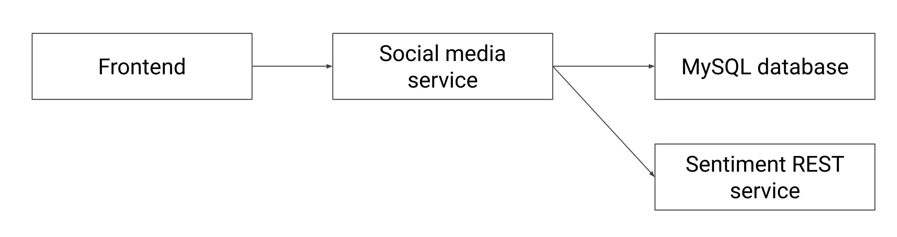
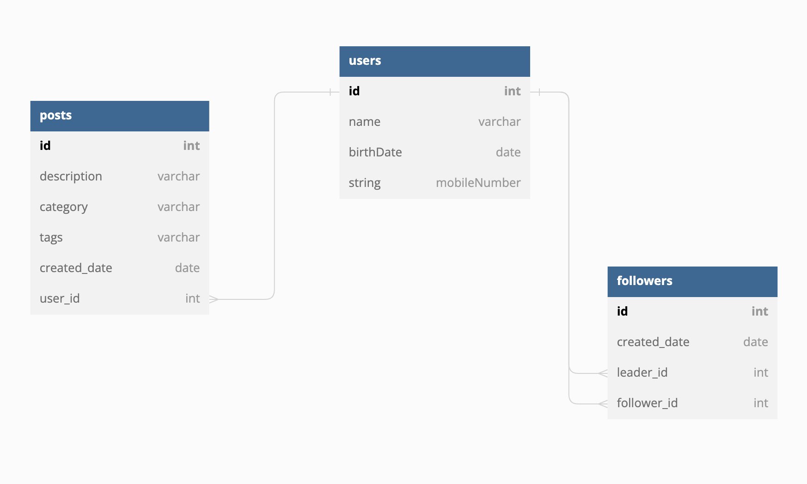

# [Ballerina] Social Media Service

The sample is based on a simple API written for a social-media site (like twitter) which has users, associated posts and followers. Following is the high level component diagram.



Following is the entity relationship diagram.



Following is the service description.

```ballerina
type SocialMedia service object {
    *http:Service;

    // users resource
    resource function get users() returns User[]|error;
    resource function get users/[int id]() returns User|http:NotFound|error;
    resource function post users(NewUser newUser) returns http:Created|error;
    resource function delete users/[int id]() returns http:NoContent|error;

    // posts resource
    resource function get posts() returns PostWithMeta[]|error;
    resource function post users/[int id]/posts(NewPost newPost) returns http:Created|http:NotFound|http:Forbidden|error;
};
```

Following are the features covered by the scenario.

- Writing REST APIs with verbs, URLs, data
- Debugging Ballerina programs
- HTTP client
- Accessing databases
- Configurability

## Setup environment

### With Docker Compose

1. Checkout the code base and move to the root folder
2. Execute `./_resources/build-docker-images.sh` script to generate the necessary docker images.
3. Execute `docker compose up -f ./_resources/docker-compose.yml`

### Without Docker Compose

1. Setup a MySQL database
2. Execute the script `init.sql` in `_resources/db-setup` directory

## Try out

- To start the completed setup run `docker compose up -f ./_resources/docker-compose.yml`
- To send request open `social-media-request.http` file using VS Code with `REST Client` extension
- To open the frontend type `http://localhost:3001`in the browser
